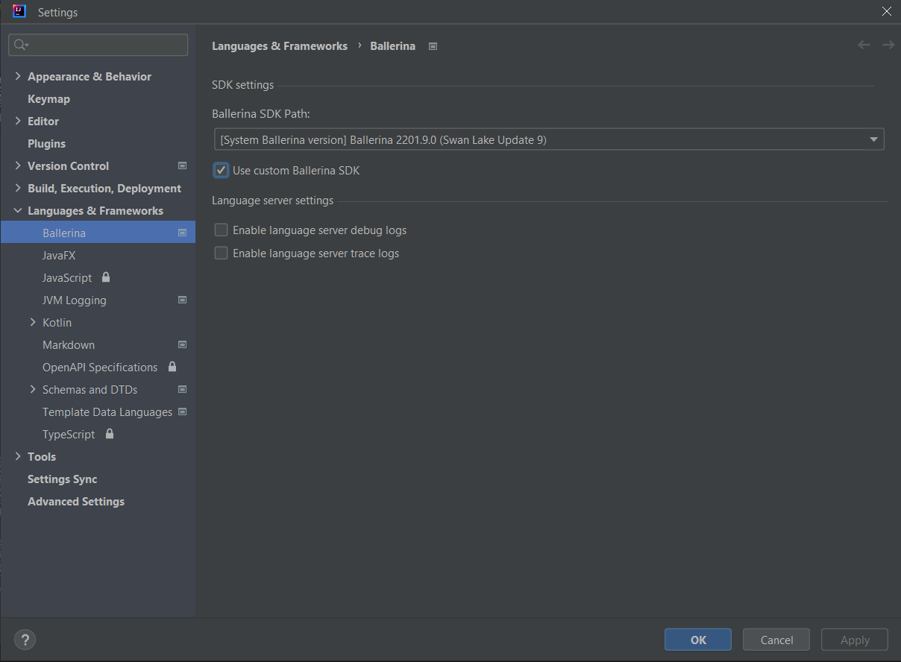
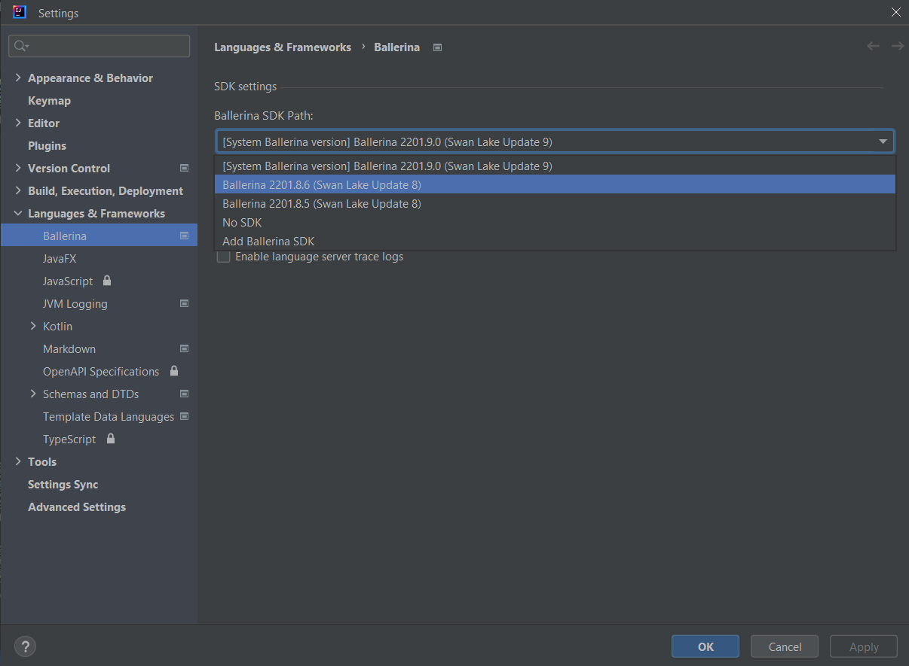
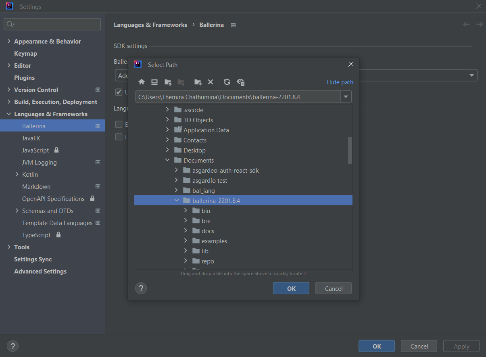

## Setting up Ballerina SDK

### SDK Auto Detection

After opening a ballerina file, the plugin will automatically detect the default ballerina SDK in the system.
If the default system ballerina SDK is not detected, and if a custom SDK is not set, the plugin will prompt you to add an SDK.

### Custom SDK Configuration

You can configure custom ballerina SDKs by going to **Settings -> Languages and Frameworks -> Ballerina -> SDK settings**.

1. Tick **Use custom Ballerina SDK** to enable custom selecting SDKs. Otherwise, the plugin will use the default system SDK.

2. Click the dropdown to select the custom SDK.

    

3. Select an available SDK or add a new SDK by clicking the `Add Ballerina SDK` option. You can also select `No SDK` to disable the plugin from using an SDK.

4. If you selected `Add Ballerina SDK` option, you will be prompted to select the Ballerina distribution location.

    

5. Click `Apply` and `OK` to save the changes.

    >**NOTE:** A restart request will pop-up after applying added/changed project SDK and please continue by choosing 
    `Restart` to restart IDEA and apply the SDK changes.
